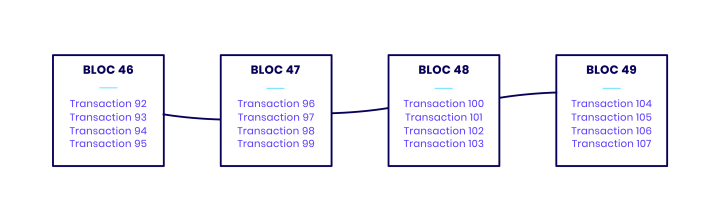

# LoutreCoin ou comment créer sa propre cryptomonnaie

## Introduction
J'ai choisi ce sujet parce que je m'intéresse à la cryptomonnaie depuis 2016. Je partais de base sur une explication du système de blockchain et de décentralisation qui est la clé de voûte du Bitcoin, mais je me suis dit que ca serait plus marrant d'expliquer tout ça avec un cas pratique: la création du **LoutreCoin**, une cryptomonnaie spécialement faite pour payer son abonnement internet chez Loutre Télécom. Dans chacunes des parties qui suivent chaque explication théorique sera accompagné de son implémentation en **Python 3**.

## Une Cryptomonnaie c'est quoi ? Ça fonctionne comment ?
Dans cette partie je vais tâcher d'expliquer ce qu'est une cryptomonnaie, son utilité et son fonctionnement. Pour commencer la cryptomonnaie est née de l'envie de certaines personnes de se détacher de toutes dépendance à un quelconque tiers pour gérer nos échanges commerciaux. En effet, dans le système monétaire actuel, lorsque Monsieur A souhaite envoyer 20 euros à Madame B, il doit contacter sa banque pour demander à cette dernière d’effectuer un virement vers le compte en banque de Madame B. Lors de cet échange, Monsieur A et Madame B font confiance à leur banque pour garantir la validité de cet échange. Ainsi ici, une unique entité tient les registres de toutes les transactions commerciales effectuées dans notre société (dans la vraie vie, il n’y a pas qu’une seule banque mais le système repose malgré tout sur un faible nombre d’entités). Dans le but de se détacher de cette “Banque Centrale” la cryptomonnaie est née. La définition la plus général est la suivante: une cryptomonnaie est une monnaie régie par aucune banque centrale, émise de pair-à-pair (**P2P**) et se basant sur la **Cryptographie** pour garantir la fiabilité des informations et l'anonymat des utilisateurs du réseau.

### Réseau pair-à-pair
Comme dit juste au-dessus notre cryptomonnaie repose sur un réseau pair-à-pair, ce dernier est un réseau informatique où chaque noeud du réseau est à la fois **Client** et **Serveur**. Ainsi chaque utilisateur du réseau envoie et reçoit des données, les données se retrouvent donc dupliquées sur chacun des nœuds.

### Le réseau pair-à-pair d’une cryptomonnaie
Pour reprendre notre exemple précédent, Monsieur A et Madame B sont membres d’un réseau pair-à-pair de 10 personnes. Lorsque Monsieur A souhaite envoyer 20 euros à Madame B, il l’annonce au réseau et chaque membre du réseau va vérifier avec sa version des registres que A possède le solde nécessaire pour transmettre de l’argent à B. Si la majorité du réseau donne son accord à la transaction, cette dernière est actée et les membres ayant refusé la transaction doivent modifier leur version local des données pour s’aligner sur celle adopté par la majorité. A et B sont donc totalement détachés d’une banque centrale vu qu’ici chacun utilisateur du réseau tient un registre des transactions commerciales.

## Principe de base d’une Blockchain
L'exemple ci-dessus stipule que chacun stock l’historique des transactions du réseau au fil du temps sans jamais supprimer ces dernières. Il faut donc trouver un moyen efficace de stocker la donnée dans le temps. La solution qui n’a pas du tout été divulguée dans le titre de cette partie c’est … Surprise ! La **Blockchain** ! En effet, la Blockchain est une manière de conserver de la donnée. Comme indiqué dans le nom il s’agit d’une chaîne de blocs où chacun des blocs est un ensemble de données, à tout hasard: des transactions. Chaque bloc se retrouve donc attribué à un nom unique et conserve un certain nombre de transactions (par exemple une dizaine) et le nom du bloc qui le précède dans la chaîne, sinon on aurait pas une chaîne mais juste un amas de blocs désordonnés. 
On se retrouve donc avec la structure de donnée suivante:



Nous avons désormais des blocs de transactions pour conserver nos registres à travers le temps mais comment garantir la fiabilité des données et rendre chacun des blocs unique ?

## Cryptographie joins the battle !  *Smash Brawl ~ Main Theme*
En effet, la cryptographie va nous être très utile dans de nombreux aspects de la Blockchain. Dans un premier temps, on va se servir de la cryptographie et plus particulièrement de la fonction de hachage sha-256 pour nommer nos blocs de manière unique et pour garantir la validité des données. Une fonction de hachage est une fonction particulière qui prend des données en entrée et donne comme résultat une suite de caractères alphanumérique unique unique. Par exemple on peut comparer les “hash” de 0 et 1 en sha-256:

```python
sha256(0) = 5feceb66ffc86f38d952786c6d696c79c2dbc239dd4e91b46729d73a27fb57e9
sha256(1) = 6b86b273ff34fce19d6b804eff5a3f5747ada4eaa22f1d49c01e52ddb7875b4b
```

On voit bien avec cet exemple que nos deux “hash” sont complètement différents. Ainsi pour garantir la fiabilité de nos blocs on prendra comme donnée d'entrée de la fonction de hash la liste de nos transactions avec le format suivant:

```
Date Transaction + Sender + Amount + Receiver
```

On a enfin tous les éléments nécessaire de design pour commencer à implémenter notre **Blockchain Maison**.
