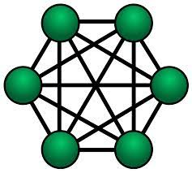

# LoutreCoin ou comment créer sa propre cryptomonnaie

## Introduction
J'ai choisi ce sujet parce que je m'intéresse à la cryptomonnaie depuis 2016. Je partais de base sur une explication du système de blockchain et de décentralisation qui est la clé de voûte du Bitcoin, mais je me suis dit que cela serait plus amusant d'expliquer tout ça avec un cas pratique: la création du **LoutreCoin**, une cryptomonnaie spécialement faite pour payer son abonnement internet chez Loutre Télécom. Ainsi, chaque explication théorique sera accompagné de son implémentation en **Python 3**.

## Une Cryptomonnaie c'est quoi ? Ça fonctionne comment ?
Dans cette partie, je vais tâcher d'expliquer ce qu'est une cryptomonnaie, son utilité et son fonctionnement. Pour commencer la cryptomonnaie est née de l'envie de certaines personnes de se détacher de toutes dépendance à un quelconque tiers pour gérer nos échanges commerciaux. En effet, dans le système monétaire actuel, lorsque Monsieur A souhaite envoyer 20 euros à Madame B, il doit contacter sa banque pour demander à cette dernière d’effectuer un virement vers le compte en banque de Madame B. Lors de cet échange, Monsieur A et Madame B font confiance à leur banque pour garantir la validité de cet échange. Ainsi ici, une unique entité tient les registres de toutes les transactions commerciales effectuées dans notre société (dans la vraie vie, il n’y a pas qu’une seule banque mais le système repose malgré tout sur un faible nombre d’entités). Dans le but de se détacher de cette “Banque Centrale” la cryptomonnaie est née. La définition la plus général est la suivante: une cryptomonnaie est une monnaie régie par aucune banque centrale, émise de pair-à-pair (**P2P**) et se basant sur la **Cryptographie** pour garantir la fiabilité des informations et l'anonymat des utilisateurs du réseau.

### Réseau pair-à-pair
Comme dit juste au-dessus notre cryptomonnaie repose sur un réseau pair-à-pair, ce dernier est un réseau informatique où chaque noeud du réseau est à la fois **Client** et **Serveur**. Ainsi chaque utilisateur du réseau envoie et reçoit des données, les données se retrouvent donc dupliquées sur chacun des nœuds.



### Le réseau pair-à-pair d’une cryptomonnaie
Pour reprendre notre exemple précédent, Monsieur A et Madame B sont membres d’un réseau pair-à-pair de 10 personnes. Lorsque Monsieur A souhaite envoyer 20 euros à Madame B, il l’annonce au réseau et chaque membre du réseau va vérifier avec sa version des registres que A possède le solde nécessaire pour transmettre de l’argent à B. Si la majorité du réseau donne son accord à la transaction, cette dernière est actée et les membres ayant refusé la transaction doivent modifier leur version local des données pour s’aligner sur celle adopté par la majorité. A et B sont donc totalement détachés d’une banque centrale vu qu’ici chacun utilisateur du réseau tient un registre des transactions commerciales.

## Principe de base d’une Blockchain
L'exemple ci-dessus stipule que chacun stock l’historique des transactions du réseau au fil du temps sans jamais supprimer ces dernières. Il faut donc trouver un moyen efficace de stocker la donnée dans le temps. La solution qui n’a pas du tout été divulguée dans le titre de cette partie c’est … Surprise ! La **Blockchain** ! En effet, la Blockchain est une manière de conserver de la donnée. Comme indiqué dans le nom il s’agit d’une chaîne de blocs où chacun des blocs est un ensemble de données, à tout hasard: des transactions. Chaque bloc se retrouve donc attribué à un nom unique et conserve un certain nombre de transactions (par exemple une dizaine) et le nom du bloc qui le précède dans la chaîne, sinon on aurait pas une chaîne mais juste un amas de blocs désordonnés. 
On se retrouve donc avec la structure de donnée suivante:


Nous avons désormais des blocs de transactions pour conserver nos registres à travers le temps mais comment garantir la fiabilité des données et rendre chacun des blocs unique ?

## Cryptographie joins the battle !  *Smash Brawl ~ Main Theme*
Dans cette partie, je vais introduire et expliquer en quoi la cryptographie va rendre la Blockchain très attrayante pour une cryptomonnaie et un réseau pair-à-pair.
En effet, la cryptographie va nous être très utile dans de nombreux aspects de la Blockchain. Dans un premier temps, on va se servir de la cryptographie et plus particulièrement de la fonction de hachage sha-256 pour nommer nos blocs de manière unique et pour garantir la validité des données. Une fonction de hachage est une fonction particulière qui prend des données en entrée et donne comme résultat une suite de caractères alphanumérique unique unique. Par exemple on peut comparer les “hash” de 0 et 1 en sha-256:

```python
sha256(0) = 5feceb66ffc86f38d952786c6d696c79c2dbc239dd4e91b46729d73a27fb57e9
sha256(1) = 6b86b273ff34fce19d6b804eff5a3f5747ada4eaa22f1d49c01e52ddb7875b4b
```
On voit bien avec cet exemple que nos deux “hash” sont complètement différents. Ainsi pour garantir la fiabilité de nos blocs on prendra comme donnée d'entrée de la fonction de hash du bloc les informations diverses du bloc ainsi que la liste des “hash” de nos transactions avec le format  d'entrée suivant:
```
Date Transaction + Sender + Amount + Receiver
```

On a enfin tous les éléments nécessaire de design pour commencer à implémenter notre **Blockchain Maison**

## Début du codage
A présent, nous allons pouvoir commencer à implémenter notre petit script Python pour illustrer mes propos.
On a donc besoin de 3 classes Python pour représenter la Blockchain:

```python
class Blockchain:
  def __init__(self):
    self.chain = []

class Block:
  def __init__(self, transactions, time, index):
    self.index = index
    self.transactions = transactions
    self.time = time
    self.prev = ''
    self.hash = ''

class Transaction:
  def __init__(self, sender, receiver, amount):
    self.sender = sender
    self.receiver = receiver
    self.amount = amount
    self.time = datetime.now().strftime("%d/%m/%Y-%H:%M:%S")
    self.hash = ''
```

On a donc des transactions qui gèrent des données plutôt classiques: un émetteur, un receveur, un montant et une date.  Ensuite nous avons nos blocs qui stockent une liste de transaction, une date de création et un index qui correspond au numéro du bloc fraîchement créé. Enfin, la Blockchain en elle-même qui stocke simplement une liste de blocs.

Il faut maintenant implémenter le hachage de nos transactions et de nos blocs, pour ca nous utiliserons le module *hashlib* directement disponible dans la bibliothèque standard de **Python**. On implémente donc la fonction `calculateHash()` dans les classes `Block` et `Transaction`. On obtient donc le code suivant:

```python
class Block:
  # …
  self.hash = self.calculateHash()
  
  def calculateHash():
    transactionsHash = ""
    for transaction in self.transactions:
      transactionsHash += transaction.hash

    clearStr = str(self.index) + str(self.time) + transactionsHash + self.prev
    return hashlib.sha256(str.encode(clearStr)).hexdigest()

class Transaction:
  # …
  self.hash = self.calculateHash()
  
  def calculateHash(self):
    clearStr = str(self.time) + self.sender + str(self.amount) + self.receiver
    return hashlib.sha256(str.encode(clearStr)).hexdigest()
```

J'en profite également pour implémenter l'ajout d'un bloc dans la **Blockchain** qui mettra à jour le champ `prev` avec le dernier bloc actuel de la chaîne. La fonction est la suivante:

```python
def addBlock(self, block):
  if (len(self.chain) > 0):
    block.prev = self.chain[-1].hash
   else:
    block.prev = "None"
  self.chain.append(block)
```

Nous avons maintenant une première version fonctionnel de notre **Blockchain**. Est-on pour autant sûr de la fiabilité de nos données ? Pas vraiment... En effet, reprenons l’exemple de notre groupe de 10 personnes avec Monsieur A et Madame B, si parmi les 10 personnes se trouve quelqu’un avec de mauvaises intentions. Cette personne cherche à se donner plus d’argent en modifiant un registre, il lui suffira d’avoir le contrôle sur plus de 50% du réseau pair-à-pair et de modifier une transaction à la main. En modifiant cette transaction le hash de cette dernière sera forcément changer, ainsi le hash du bloc dans laquelle se trouve la transaction sera également modifié. En changeant uniquement un bloc, l’attaque échoue car le hash du bloc qui suit dans la chaîne ne stockera pas le bon hash pour le bloc précédent sauf que actuellement il est très rapide de calculer le hash des blocs. Il suffira donc à notre attaquant de recalculer tous les hash de la chaîne pour obtenir une version “valide” de la blockchain malgré la transaction frauduleuse introduite. On va donc pouvoir introduire un nouveau mécanisme dans notre **Blockchain** pour contrer ce genre d’attaques: la preuve de travail (Proof of Work en anglais).

## La preuve de travail
La preuve de travail est une manière de dissuader les attaques par déni de service en requérant de la puissance de calcul de l’appareil demandeur du service. Appliqué à la Blockchain cela permet d'éviter une modification frauduleuse des transactions car il serait trop coûteux à notre attaquant de recalculer la totalité des hash de chaque bloc. Le principe de la preuve de travail est de calculer le hash d’un bloc jusqu'à que ce dernier commence par un nombre prédéterminé de 0 en guise d'en-tête du hash, par exemple, au lieu d’avoir des hash de la forme suivante: `5feceb66ffc86f38d952786c6d696c79c2dbc239dd4e91b46729d73a27fb57e9` on aura des hash de la forme suivante avec 4 zéros en entete par exemple: `0000b273ff34fce19d6b804eff5a3f5747ada4eaa22f1d49c01e52ddb7875b4b`. Pour forcer le hash à prendre cet forme on influe sur les données en entrée de la fonction de hash avec un entier **x** calculer par “brute force”, ce processus s’appelle le **minage**. Il s’agit donc d’essayer avec un **x** allant de 0 à l’infini de 1 en 1, on essayera donc toutes les valeurs possibles jusqu’à obtenir un hash respectant le format souhaité. Pour motiver les utilisateurs du réseau à calculer ces preuves de travail et donc de miner des blocs pour sauvegarder les transactions, on récompense la première personne à miner un nouveau bloc (c’est à dire trouver le **x** inconnu) avec un certain montant de cryptomonnaie, ici on choisira arbitrairement de donner un LoutreCoin (1 LC). Nos transactions ne seront donc effectives qu’à partir du moment où elles se trouveront dans un bloc valide (qui a été miné), on va donc rajouter une liste de transactions en attente dans notre classe `Blockchain` et les fonctions nécessaires pour miner un bloc. De plus, je rajoute une fonction pour instancier la Blockchain avec un bloc contenant 0 transactions. On a donc une classe Blockchain qui ressemble à ce qui suit:
```python
class Blockchain:
    def __init__(self):
        self.chain = [self.addLeadingBlock()]
        self.pendingTransactions = []
        self.header = 4 # Leading Zero wanted for block's hashes
        self.mineReward = 1
        self.blockSize = 5 # Maximum amount of transactions inside one block

    def addLeadingBlock(self):
        currentTime = datetime.now().strftime("%d%m%Y-%H:%M:%S")
        block = Block([], currentTime, 0)
        block.prev = "None"
        return block

    def addBlock(self, block):
        if (len(self.chain) > 0):
            block.prev = self.chain[-1].hash
        else:
            block.prev = "None"

        self.chain.append(block)

    def mine(self, miner):
        pendingSize = len(self.pendingTransactions)
        if (pendingSize <= 0):
            print("Not enough pending transactions to mine a new block. Must be > 1")
            return False
        else:
            for i in range(0, pendingSize, self.blockSize):
                end = i + self.blockSize
                if i >= pendingSize:
                    end = pendingSize

                nextTransactions = self.pendingTransactions[i:end]
                currentTime = datetime.now().strftime("%d%m%Y-%H:%M:%S")

                newBlock = Block(nextTransactions, currentTime, len(self.chain))

                newBlock.prev = self.chain[-1].hash
                newBlock.mine(self.header)

                self.chain.append(newBlock)

            print("Mining pending transactions success!")

            rewardMiner = Transaction("LoutreCoin mining reward", miner, self.mineReward)
            self.pendingTransactions = [rewardMiner]

        return True
```
 
 Et du coté de la classe `Block` on aura le code suivant:
 ```python
 class Block:
    def __init__(self, transactions, time, index):
        self.index = index
        self.transactions = transactions
        self.time = time
        self.proof = 0 # Proof of Work 'x' Value
        self.prev = ''
        self.hash = self.calculateHash()

    def calculateHash(self):
        transactionsHash = ""
        for transaction in self.transactions:
            transactionsHash += transaction.hash

        clearStr = str(self.index) + str(self.time) + transactionsHash + self.prev + str(self.proof)
        return hashlib.sha256(str.encode(clearStr)).hexdigest()

    def mine(self, header):
        pattern = "0" * header
        while self.hash[0:header] != pattern:
            self.proof += 1
            self.hash = self.calculateHash()
            print("X:", self.proof)
            print("Hash attempt:", self.hash)
            print("Pattern wanted:", pattern, "...")

        print("\nBlock Mined! Proof of Work value: ", self.proof)
 ```

## Anonymat des utilisateurs et vérification de l'émetteur d’une transaction
Pour cette dernière partie, nous allons rendre anonyme et unique chaque utilisateur de notre réseau. Actuellement, n’importe qui peut émettre une transaction avec n’importe quelle identité, ce qui est quelque peu problématique. On attribuera donc un portefeuille de **LoutreCoin** à chacun de nos utilisateurs. Ces portefeuilles seront chiffrvia du RSA, qui est un chiffrement asymétrique, c'est-à-dire que le portefeuille possède une clé publique pour recevoir de l’argent et une clé privée pour signer les transactions émanant de ce dernier. Pour passer l’étape d’implémentation du chiffrement RSA, j’utiliserais la bibliothèque **PyCryptoDome**. On aura donc une fonction pour générer et stocker dans des fichiers une paire de clé unique pour chaque utilisateur:
```python
    def generateKeys(self):
        key = RSA.generate(2048)
        private_key = key.export_key()
        file_out = open("rsa_pub.key", "wb")
        file_out.write(private_key)

        public_key = key.publickey().export_key()
        file_out = open("rsa.key", "wb")
        file_out.write(public_key)

        return key.publickey().export_key().decode('ASCII')
```
Ensuite j’ai rajouté des fonctions dans `Transaction` pour pouvoir signer une transaction et vérifier les clés publiques du portefeuille et de la transaction. On a donc la classe suivante:
```python
class Transaction:
    def __init__(self, sender, receiver, amount):
        self.sender = sender
        self.receiver = receiver
        self.amount = amount
        self.time = datetime.now().strftime("%d/%m/%Y-%H:%M:%S")
        self.hash = self.calculateHash()

    def calculateHash(self):
        clearStr = str(self.time) + self.sender + str(self.amount) + self.receiver
        return hashlib.sha256(str.encode(clearStr)).hexdigest()

    def isValidTransaction(self):

        if(self.hash != self.calculateHash()):
            return False;
        if(self.sender == self.receiver):
            return False;
        if(self.sender == "LoutreCoin"):
            #security : unfinished
            return True;
        if not self.signature or len(self.signature) == 0:
            print("No Signature!")
            return False;
        return True;

    def signTransaction(self, key, senderKey):
        if(self.hash != self.calculateHash()):
            print("transaction tampered error")
            return False

        if(str(key.publickey().export_key()) != str(senderKey.publickey().export_key())):
            print("Transaction attempt to be signed from another wallet")
            return False

        pkcs1_15.new(key)

        self.signature = "made"
        print("made signature!")
        return True
```

Pour terminer ce petit projet on a une dernière fonction pour ajouter proprement une transaction dans les transactions en attente d’être minée.
```python
    def addTransaction(self, sender, reciever, amount, keyString, senderKey):
        keyByte = keyString.encode("ASCII")
        senderKeyByte = senderKey.encode("ASCII")

        key = RSA.import_key(keyByte);
        senderKey = RSA.import_key(senderKeyByte)

        if not sender or not reciever or not amt:
            print("Invalid Transaction parameters")
            return False

        transaction = Transaction(sender, reciever, amount)
        transaction.signTransaction(key, senderKey)

        if not transaction.isValidTransaction():
            print("Invalid Transaction")
            return False
        self.pendingTransactions.append(transaction)
        return len(self.chain) + 1
```

## Conclusion
Pour conclure, ce projet est fonctionnel mais comme tout projet il me reste encore mille et une améliorations possibles. Malgré tout j’espère avoir atteint mon objectif qui était de vous introduire au monde captivant de la Cryptomonnaie et de vous permettre d’acquérir toutes les clés pour comprendre le fonctionnement d’une Blockchain à travers le LoutreCoin.
